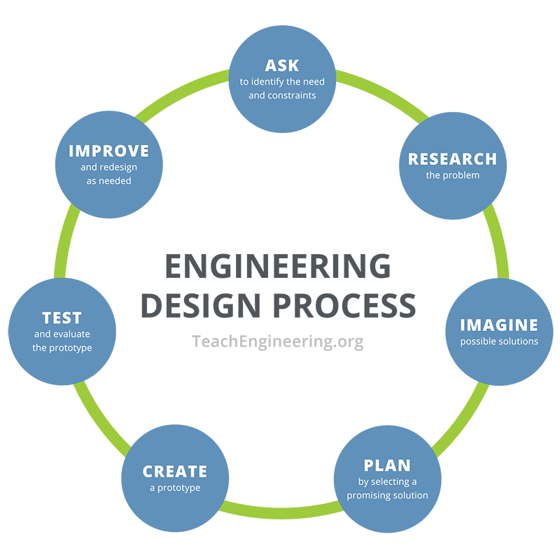

# finch-robot

### Development Checklist

| Completed | Task         | Description |
|:---------:| :-----------:|:------------|
|    ✅     | Familiarize  | Learn how to: <ul><li>Connect to the robot</li><li>Interpret what built-in sensors detect</li><li>Program basics in SNAP!</li><li>Setup local developing environment to code in Java</li></ul>|
|    ✅     | 3D Design    |             |
|    ✅     | Develop Code |    Timer    |

---

<strong>Inspiration for the Project</strong>

A fun mingame for friends to play but also adding in a competitive nature to it with 5 different distances that is farther than the previous.Each distance would give the player 60 seconds to score as much points as possible.

---

### Design Cycle

###### Include commentary on your experience with the design cycle during this project

---

### Code to Highlight
###### Include annotated code snippets 

---

### Choose At Least Three of the Following to Include:
- What was your motivation?
- Why did you build this project? (Note: the answer is not "Because it was a homework assignment.")
- What problem does it solve?
- What did you learn?
- What makes your project stand out?
